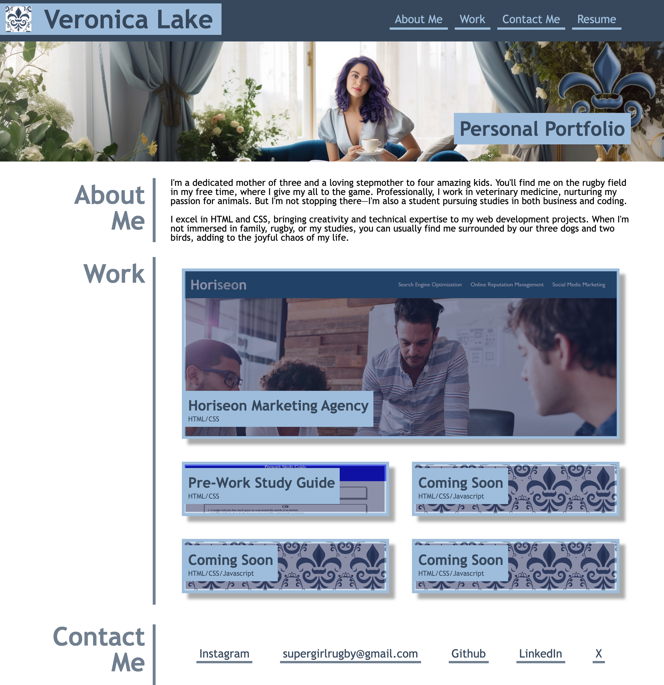

# Advanced-CSS-Portfolio

## Description

A Personal Web Portfolio dedicated to shocasing current, and upcoming projects for Veronica Lake.

## Preview

## Links
<ul>

[Preview] https://github.com/RugbyVeronica/VeronicaLakePortfolio/blob/main/assets/images/preview.png

[Repository] https://github.com/RugbyVeronica/VeronicaLakePortfolio

[Live] https://rugbyveronica.github.io/VeronicaLakePortfolio/

</ul>

## Creation
1. Created the HTML Index file
2. Added semantic elements for clarity
3. Typed up the about me and work sections
4. Made sure my first work is larger than the rest
5. Page is responsive to all screen sizes
6. Made notes in both HTML & CSS
7. Used var to make sure repeating sytles had less code.